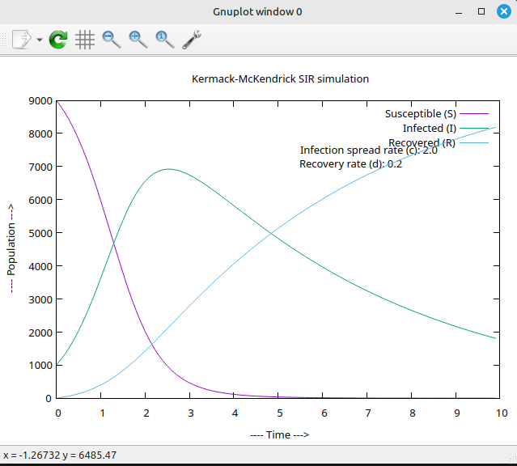

# Kermack-McKendrick SIR Model Simulation

## Overview

This is a C implementation of the Kermack-McKendrick SIR (Susceptible-Infected-Recovered) epidemiological model. The SIR model is a compartmental model used to simulate the spread of infectious diseases through a population over time.

## Model Description

### Variables

| Variable | Description                                                  |
|----------|--------------------------------------------------------------|
| `N`      | Total population                                             |
| `t`      | Time                                                         |
| `S`      | Susceptible population (capable of being infected)           |
| `I`      | Infected population                                          |
| `R`      | Recovered population, no longer infectious (died, recovered) |
| `c`      | Infection rate                                               |
| `d`      | Recovery rate (died, recovered)                              |

### Mathematical Model

The SIR model is governed by the following differential equations:

- `dS/dt = -c * S * I / N` 
- `dI/dt = c * S * I / N - d * I`
- `dR/dt = d * I`

Where:
- **dS/dt**: Rate of change of susceptible population
- **dI/dt**: Rate of change of infected population
- **dR/dt**: Rate of change of recovered population

## Features

- **Numerical simulation**: Uses Euler's method for numerical integration
- **Data export**: Saves simulation results to `sir.txt` file
- **Visualization**: Generates plots using GnuPlot
- **Real-time output**: Displays simulation progress in console

## Default Parameters

| Parameter               | Default Value | Description                       |
|-------------------------|---------------|-----------------------------------|
| Total Population (N)    | 10,000        | Total population size             |
| Initial Susceptible (S) | 9,000         | Initially susceptible individuals |
| Initial Infected (I)    | 1,000         | Initially infected individuals    |
| Initial Recovered (R)   | 0             | Initially recovered individuals   |
| Infection Rate (c)      | 2.0           | Rate of infection spread          |
| Recovery Rate (d)       | 0.2           | Rate of recovery/removal          |
| Time Scale              | 0.1           | Scaling factor for time steps     |
| Simulation Steps        | 100           | Number of iterations              |

## Usage

### Compilation

```bash
gcc -o sir src/SIR.c
```

### Execution
```bash
./sir
```

### Requirements
- GCC compiler
- GnuPlot (for visualization)

### File Output
Results are saved to `sir.txt` with the same format for plotting.

### Visualization
The program automatically generates a GnuPlot visualization showing:
- Blue line: Susceptible population over time
- Red line: Infected population over time
- Green line: Recovered population over time


*Example output showing the classic SIR model behavior with infection spread and recovery rates*
